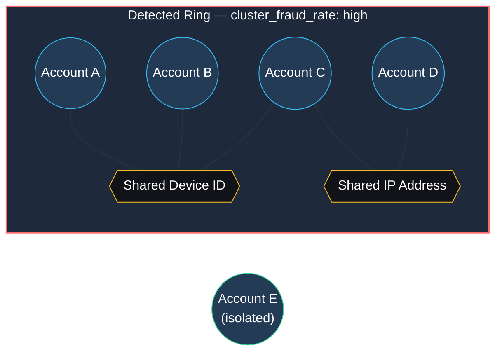
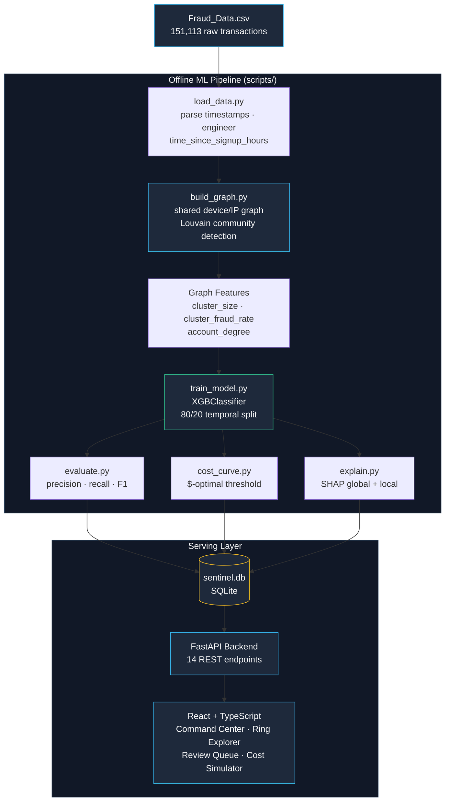
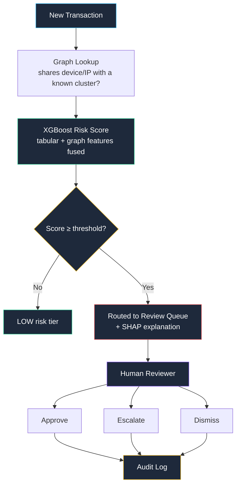
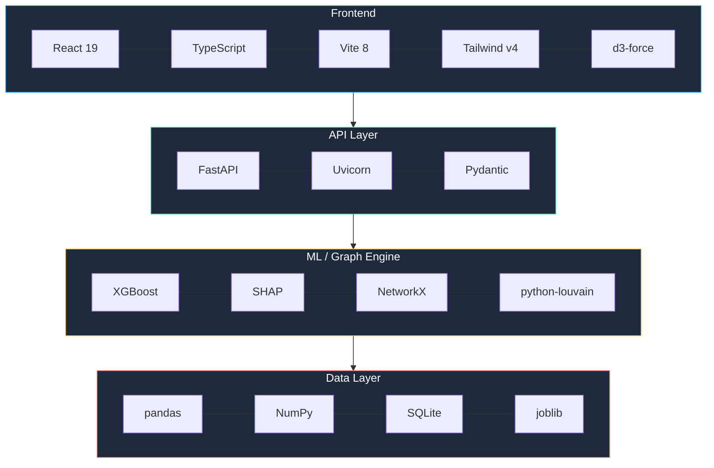

<div align="center">


# 🛡️ COFRAUD

### Graph-Native Fraud Ring Detection with Cost-Aware, Human-in-the-Loop Decisioning

*Fraud doesn't act alone. Neither should your detection system.*


[](https://abuse-ring-sentinel-drab.vercel.app/)
[](#deployment--links)
[](https://razorpay.com/buildathon/)
[](https://razorpay.com/buildathon/)

<br/>

**Indore Institute of Science and Technology (IIST), Indore**

| Built & Presented By |
|---|
| **Nandini Singh** — Full-Stack ML, Graph Engineering, Backend, Frontend |

<br/>

[](https://www.python.org/)
[](https://fastapi.tiangolo.com/)
[](https://xgboost.readthedocs.io/)
[](https://shap.readthedocs.io/)
[](https://networkx.org/)
[](https://react.dev/)
[](https://www.typescriptlang.org/)
[](https://vitejs.dev/)
[](https://www.sqlite.org/)

</div>

---

## 🔗 Deployment & Links

| Category | Deliverable | Link |
|---|---|---|
| 💻 Codebase | Main GitHub Repository | [github.com/Nandinisingh07/cofraud](https://github.com/Nandinisingh07/cofraud) |
| 🌐 Web Platform | Live Deployed Frontend | [abuse-ring-sentinel-drab.vercel.app](https://abuse-ring-sentinel-drab.vercel.app/) |
| 🏠 Landing Page | CoFraud — Enterprise Fraud Intelligence | [abuse-ring-sentinel-drab.vercel.app](https://abuse-ring-sentinel-drab.vercel.app/) |
| ⚡ Backend | Live FastAPI Service | https://abuse-ring-sentinel-pvk8.onrender.com |
| 📡 API Docs | Interactive Swagger Spec | https://abuse-ring-sentinel-pvk8.onrender.com/docs |
| 🎬 Animated Video | Stylized Intro/Demo | [docs/demo/cofraud-demo.mp4](docs/demo/cofraud-demo.mp4) |
| 🎬 Demo Video | Full Product Walkthrough | [Watch on Google Drive](https://drive.google.com/file/d/1UYl_p1Z71cfwfULbZFRECRHw0s148mel/view?usp=drive_link) |
| 📄 Documentation | Full Project Report | [View on Google Docs](https://docs.google.com/document/d/1XG8c3HZu99KhsskTnaxnFJ9vMprfj0Of/edit?usp=drive_link) |

> ⚠️ **Before submitting:** the frontend's API base URL must point at your *deployed* backend (`VITE_API_BASE_URL`), not `http://localhost:8080`. Test every link above in an incognito window.

---

### Demo Videos & Documentation

<table>
<tr>
<td width="33%" align="center">

<a href="docs/demo/cofraud-demo.mp4">

</a>
<br/>
<a href="docs/demo/cofraud-demo.mp4">

</a>

</td>
<td width="33%" align="center">

<a href="https://drive.google.com/file/d/1UYl_p1Z71cfwfULbZFRECRHw0s148mel/view?usp=drive_link">

</a>
<br/>
<a href="https://drive.google.com/file/d/1UYl_p1Z71cfwfULbZFRECRHw0s148mel/view?usp=drive_link">

</a>

</td>
<td width="33%" align="center">

<a href="https://docs.google.com/document/d/1XG8c3HZu99KhsskTnaxnFJ9vMprfj0Of/edit?usp=drive_link">

</a>
<br/>
<a href="https://docs.google.com/document/d/1XG8c3HZu99KhsskTnaxnFJ9vMprfj0Of/edit?usp=drive_link">

</a>

</td>
</tr>
</table>

---

## Table of Contents

- [Overview](#overview)
- [The Problem](#the-problem)
- [What a Ring Actually Looks Like](#what-a-ring-actually-looks-like)
- [Architecture — The Detection Pipeline](#architecture--the-detection-pipeline)
- [The Detection Cycle](#the-detection-cycle)
- [Model Results](#model-results)
- [Tech Stack](#tech-stack)
- [Product Walkthrough](#product-walkthrough)
- [Project Directory Structure](#-project-directory-structure)
- [Setup & Local Installation](#setup--local-installation)
- [API Reference](#-api-reference)
- [Design Principles](#design-principles)
- [Known Limitations](#known-limitations)

---

## Overview

Most fraud systems score **one transaction at a time**. **CoFraud** instead builds a **shared-attribute graph** across every account — connecting accounts that share a device ID or IP address — runs **Louvain community detection** to surface coordinated rings, and fuses those graph signals into an **XGBoost classifier** alongside standard transaction features.

Every score ships with a **SHAP explanation**. Every flagged account goes to a **human reviewer** — the system never auto-blocks. Every reviewer action is **logged and audit-exportable**. And the decision threshold isn't hardcoded — a **cost simulator** lets an ops team pick it based on real dollar trade-offs between false positives and missed fraud.

This is not a fraud-scoring notebook. It is a full-stack fraud-ops product: graph engine → ML pipeline → REST API → review dashboard.

> **Dataset:** [Kaggle Fraud E-Commerce dataset](https://www.kaggle.com/datasets/vbinh002/fraud-ecommerce) — the source of `Fraud_Data.csv` and every number in this README.

---

## The Problem

| | Traditional Fraud Scoring |
|---|---|
| 🔲 **Isolated scoring** | Each account scored alone. A ring of 8 accounts sharing one device looks like 8 unremarkable individuals. |
| ⬛ **Black-box risk** | A number comes out with no explanation — reviewers can't say *why*, so trust in the model erodes. |
| 🔲 **Fixed thresholds** | One cutoff, chosen once, never revisited against actual review-cost vs. fraud-cost trade-offs. |
| ⬛ **Auto-block risk** | Automated rejection, no human check — a single false positive becomes a lost legitimate customer instantly. |

**CoFraud addresses all four:** graph-aware scoring, SHAP-backed explanations, a live cost simulator, and a strict human-review-only policy.

---

## What a Ring Actually Looks Like

This is the core idea in one picture. Individually, none of these accounts looks risky. Connected by a shared device or IP, the pattern is obvious:



Four accounts, no direct relationship to each other on paper — but all four touch the same device or IP. Louvain community detection isolates this as one cluster; `cluster_size`, `cluster_fraud_rate`, and `account_degree` become model features. **Account E**, with no shared attributes, stays untouched — the system doesn't penalize accounts just for existing near a ring.

---

## Architecture — The Detection Pipeline



**Two leakage guards protect every number in this README:**
- **Temporal split** — trained only on the earliest 80% of transactions by time, evaluated on the latest 20% it has never seen
- **Leave-one-out cluster fraud rate** — an account's own label is never used to compute its own cluster's historical fraud rate

---

## The Detection Cycle



**Automated:** scoring, clustering, explanation, routing. **Always human:** the final decision on every flagged account. The model never auto-blocks — it's built into the pipeline, not a policy layered on top.

---

## Model Results

Evaluated on a held-out temporal test set of **30,222 transactions** (**1,389 fraud cases, ~4.60% base rate**) that the model never saw during training.

<table>
<tr>
<td width="50%">

**At default threshold (0.5)**
| Metric | Value |
|---|---|
| Precision | **23.09%** |
| Recall | **37.80%** |
| F1 Score | **28.67%** |
| True Positives | 525 |
| False Positives | 1,749 |
| False Negatives | 864 |
| True Negatives | 27,084 |

</td>
<td width="50%">

**At cost-optimal threshold (0.26)**
| Metric | Value |
|---|---|
| True Positives | 571 |
| False Positives | 2,762 |
| False Negatives | 818 |
| **Total expected cost** | **$48,061.18** |
| Review cost / FP | $2.00 |
| Missed-fraud cost / FN | $52.00 |

</td>
</tr>
</table>

> **Honest framing:** 23% precision against a 4.6% base rate is roughly a **5× lift over random** — meaningful, not perfect. The **Cost Simulator** page exposes this trade-off live rather than hiding behind one fixed number.

**Top predictive features (global SHAP importance):**

| Feature | Importance | |
|---|---|---|
| `cluster_size` | 0.850 | ████████████████████ |
| `time_since_signup_hours` | 0.234 | █████▌ |
| `account_degree` | 0.185 | ████▌ |
| `cluster_fraud_rate` | 0.102 | ██▌ |
| `purchase_value` | 0.050 | █▎ |
| `source_enc` | 0.038 | ▊ |
| `age` | 0.033 | ▊ |
| `browser_enc` | 0.017 | ▎ |
| `sex_enc` | 0.005 | ▏ |

The two strongest signals — **cluster size** and **account degree** — are graph features, not transaction features. That's the core evidence for the project's thesis: **the ring is the strongest fraud signal, not any single transaction.**

---

## Tech Stack



---

## Product Walkthrough

| Page | What it's for |
|---|---|
| **Landing** | Overview of the pipeline and what the system does |
| **Command Center** | Live KPIs — scored accounts, flagged rings, pending reviews, precision/recall, risk-tier distribution |
| **Ring Explorer** | Interactive force-directed graph of every detected ring; click into any cluster or account |
| **Review Queue** | Human-in-the-loop triage — approve, escalate, or dismiss, each with a SHAP breakdown |
| **Model Insights** | Precision-recall curve, confusion matrix, global feature importance, evaluation methodology |
| **Cost Simulator** | Drag the decision threshold, watch false-positive vs. false-negative cost trade off live |
| **Audit Log** | Every reviewer action, searchable and exportable to CSV |

### Screenshots

<table>
<tr>
<td width="50%">

**Landing Page**


</td>
<td width="50%">

**Command Center**


</td>
</tr>
<tr>
<td width="50%">

**Ring Explorer**


</td>
<td width="50%">

**Review Queue**


</td>
</tr>
<tr>
<td width="50%">

**Model Insights**


</td>
<td width="50%">

**Cost Simulator**


</td>
</tr>
<tr>
<td width="100%" colspan="2">

**Audit Log**


</td>
</tr>
</table>

---

## 📁 Project Directory Structure

```
cofraud/
│
├── 📁 app/                        # FastAPI backend
│   ├── main.py                    # API routes, CORS, JSON serialization
│   └── db.py                      # Seeds sentinel.db from offline artifacts
│
├── 📁 scripts/                    # Offline ML pipeline (run once, in order)
│   ├── load_data.py                # Preprocess raw Kaggle dataset
│   ├── build_graph.py              # Shared-attribute graph + Louvain detection
│   ├── train_model.py              # XGBoost training, temporal split
│   ├── evaluate.py                 # Precision/recall/F1/confusion matrix
│   ├── cost_curve.py               # $-cost threshold sweep
│   └── explain.py                  # SHAP global + local explanations
│
├── 📁 data/                       # Generated artifacts (model, DB, JSON results)
├── 📁 data/raw/                   # Raw Kaggle CSVs
│
├── 📁 src/                        # React + TypeScript frontend
│   ├── App.tsx                     # Tab navigation, layout shell
│   ├── api.ts                      # Backend API client
│   └── 📁 pages/
│       ├── LandingPage.tsx
│       ├── CommandCenter.tsx
│       ├── RingExplorer.tsx
│       ├── ReviewQueue.tsx
│       ├── ModelInsights.tsx
│       ├── CostSimulator.tsx
│       └── AuditLog.tsx
│
├── requirements.txt                # Python dependencies
├── package.json                    # Node dependencies
└── README.md
```

---

## Setup & Local Installation

### Prerequisites
- Python 3.10+
- Node.js 18+

### 1. Clone the repository
```bash
git clone https://github.com/Nandinisingh07/cofraud.git
cd cofraud
```

### 2. Backend — build the pipeline and start the API
```bash
python -m venv venv
source venv/bin/activate        # Windows: venv\Scripts\activate
pip install -r requirements.txt

# run the pipeline once, in order, to generate all data artifacts
python scripts/load_data.py
python scripts/build_graph.py
python scripts/train_model.py
python scripts/evaluate.py
python scripts/cost_curve.py
python scripts/explain.py

# seed the database
python -m app.db

# start the API (http://localhost:8080)
uvicorn app.main:app --reload --port 8080
```

### 3. Frontend
```bash
npm install
npm run dev
```

By default the frontend expects the API at `http://localhost:8080` (`VITE_API_BASE_URL` in `.env`). **Set this to your deployed backend URL before deploying the frontend anywhere else**, or every API call will silently try to reach `localhost` on the visitor's own machine.

---

## 📡 API Reference

| Method | Endpoint | Description |
|---|---|---|
| `GET` | `/health` | Health check |
| `GET` | `/accounts` | List scored accounts (filterable by `risk_tier`, `status`) |
| `GET` | `/accounts/{user_id}` | Single account detail + SHAP explanation |
| `GET` | `/clusters` | List detected rings (filterable by `min_size`) |
| `GET` | `/clusters/{cluster_id}` | Ring detail with member accounts |
| `GET` | `/review-queue` | Pending accounts awaiting human review |
| `POST` | `/review-queue/{user_id}/action` | Submit `approve` / `escalate` / `dismiss` |
| `GET` | `/metrics` | Model evaluation results |
| `GET` | `/shap-global` | Global feature importance |
| `GET` | `/shap/{user_id}` | Local SHAP explanation for one account |
| `GET` | `/cost-curve` | Full cost-vs-threshold sweep |
| `GET` | `/cost-at-threshold?t=` | Cost breakdown at a specific threshold |
| `GET` | `/audit-log` | Reviewer action history |
| `GET` | `/audit-log/export` | Download audit log as CSV |

Full interactive spec auto-generated by FastAPI at `[your backend URL]/docs` once deployed.

---

## Design Principles

- **No automatic blocking** — every flagged account goes to a human reviewer; the system never auto-rejects a payment. A deliberate posture, not a limitation.
- **Every score is explainable** — no black-box numbers reach a reviewer without a SHAP breakdown.
- **Every decision is audited** — nothing a reviewer does disappears.
- **The threshold is a business decision** — the cost simulator exists so an ops team owns that trade-off explicitly, instead of a hardcoded cutoff.

## Known Limitations

- Precision/recall at default threshold (23% / 38%) reflects a genuinely hard, highly imbalanced problem (~4.6% fraud rate); the cost-optimal threshold (0.26) is exposed to the user rather than hidden.
- Ring detection relies on shared `device_id` / `ip_address` only — it can't catch coordinated fraud with no device or network overlap.
- New accounts with no shared device/IP history start with no cluster signal until a graph edge forms.
- Trained on the public [Kaggle Fraud E-Commerce dataset](https://www.kaggle.com/datasets/vbinh002/fraud-ecommerce) (Binh Vu, ~151K transactions, explicit `device_id`/`ip_address` fields, ~9.4% base fraud rate) for this build, not on live production traffic.
- No CI/CD or containerized deployment yet — see Setup above for manual steps.

---

<div align="center">

**Built by Nandini Singh** · Razorpay AI Builder Buildathon 2026 · AI Risk Manager Track

</div>
